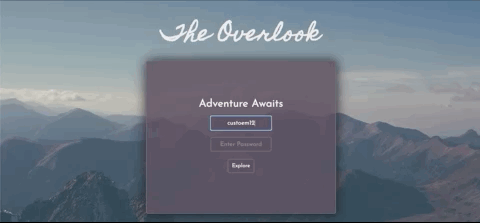
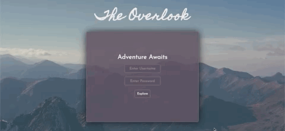

# Overlook 
Mod 2 Final Solo Project

- [Leigh Larson](https://github.com/leighlars)
- [Repo](https://github.com/leighlars/overlook-solo)
- [Project Board](https://github.com/leighlars/overlook-solo/projects)
- [Project Spec](https://frontend.turing.io/projects/overlook.html)
- [Deployed Pages]()

## Abstract 

The project asks the developer to design a functionally effective, sensible, and aesthetically pleasing UX/UI hotel management tool. The user can log in as a manager or as a guest. 

The manager can:  
View percentage and number of rooms available, today's total revenue.  
View guests' names, a list of all of their bookings, and the total amount they’ve spent  
Add a room booking for that user  
Delete any upcoming room bookings for that user (they cannot delete a booking from the past)

The guest can: 
Select date to book a room  
Upon selecting a date, user should be shown a list of room details for only rooms that are available on that date  
Filter the list of available rooms by their roomType property  
Select a room for booking  
View an apology notice and prompt to select new date in the event rooms are unavailable on chosen date  
View any room bookings (past or present)  
The total amount they have spent on rooms  

## Technologies / Systems

- Javascript
- TDD with Mocha/Chai & Spies
- VSCode 
- git / Version control
- Accessibility 
- SCSS / SASS
- API Fetch/Post
- Webpack

## Set Up 

1. Clone down this repo. Since you don't want to name your project "webpack-starter-kit", you can use an optional argument when you run git clone (you replace the [...] with the terminal command arguments): git clone [remote-address] [what you want to name the repo]
2. Remove the default remote: git remote rm origin (notice that git remote -v not gives you back nothing)
3. Create a new repo on GitHub with the name of [what you want to name the repo] to be consistent with naming
4. Copy the address that you would use to clone down this repo - something like git@github.com:...
5. Add this remote to your cloned down repo: git remote add origin [address you copied in the previous step] - do not include the brackets
6. Now try to commit something and push it up to your new repo. If everything is setup correctly, you should see the changes on GitHub.
7. Once you have cloned the repo, change into the directory and install the project dependencies by running `npm install`.
8. To verify that it is setup correctly, run `npm start` in your terminal. Go to `http://localhost:8080/` to interact with the application. 
9. To log in as manager, the username is 'manager'. To login as a customer, enter the username 'customer1', or any ending number up to 50. Both passwords are 'overlook2020'.
10. Enter `control + c` in your terminal to stop the server at any time.

## Gif Showcase

 
*Viewing manager login and dashboard, including daily metrics and search functionality*

 
*Viewing manager dashboard, reviewing guest information*

 
*Logging in and viewing as guest*

 
*Searching, adding, and deleting reservations*

 
*Viewing error message when rooms are unavailable*

 
*Alert when username is incorrect*

 
*Tabbing through elements on page, 100% Lighthouse score*

 
*Mobile view*

## Reflections
I am excited that I was able to accomplish so much with this project. From the beautiful, responsive, and sensible design using SCSS, to the 100% Accessibility score, to fetching, posting, and deleting data to the API, fetching data throughout the use of the app for UX friendliness, to the utilization of spies/testing, I am proud of this project. I used friends to test my app for changes and recommendations. This project felt good most of the way, with tiny speed bumps at the start. 
I would have liked to dove deeper into spies testing for fetch and DOM Updates. Additionally, I left the HTML / CSS code logic in for the tags, but I left them in for styling purposes. The tags do not actually filter any rooms (non-functional). 
Inheritance clicked with me the night before, and while I was able to implement it with my Guest class from the User class, I would have had to change significant code to make it work for Manager class, and that was too close to the finish line for me to do so. I left a commented out file with notes in Manager to demonstrate my understanding and how I would do it moving forward. 
